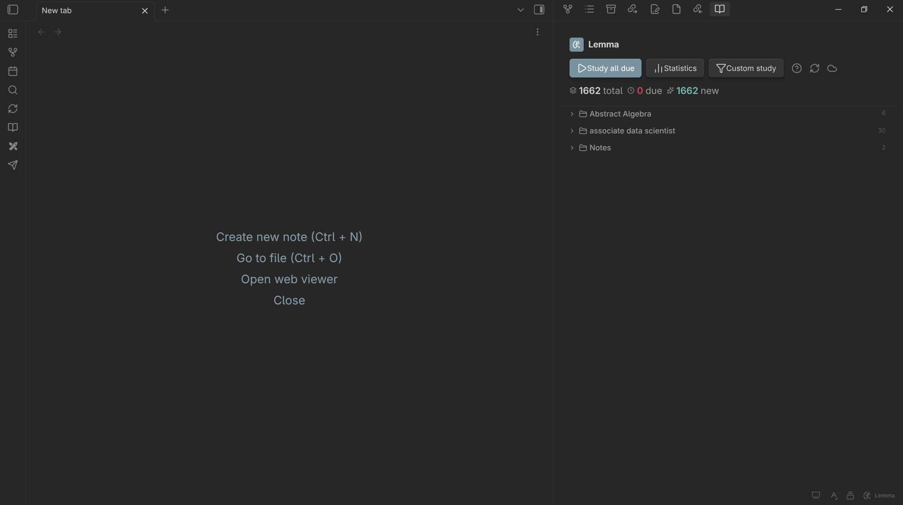
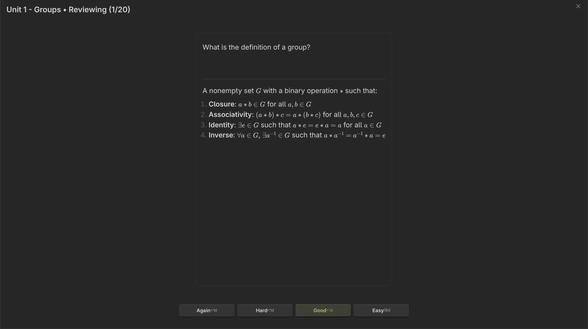
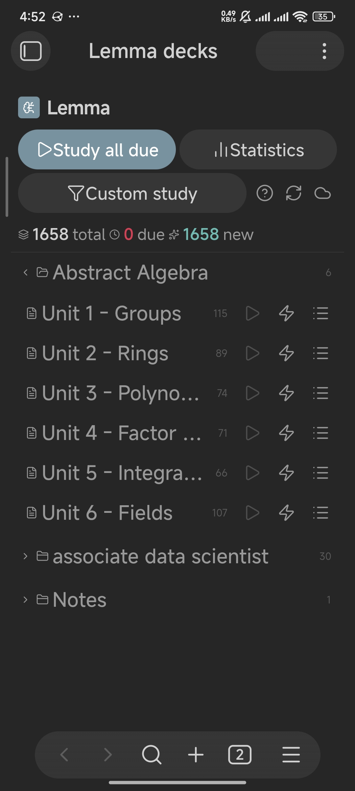
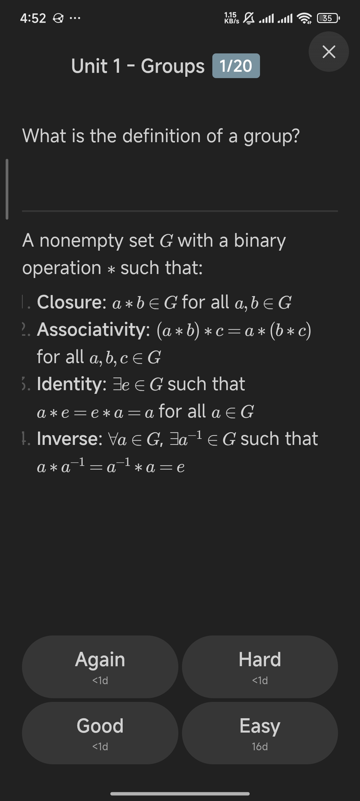
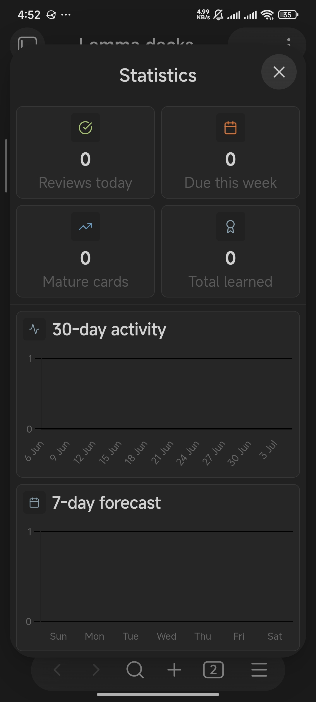

# Lemma

Lemma is an Obsidian plugin for creating and reviewing flashcards with the FSRS (Free Spaced Repetition Scheduler) algorithm.

## Screenshots

### Desktop
<p align="center">
  
  
</p>

### Mobile
<p align="center">
  
  
  
</p>

## Features

- **FSRS scheduling** - Modern spaced repetition algorithm for optimal memory retention
- **Basic & cloze cards** - Support for multiple card formats
- **Dashboard view** - Overview of all decks with due counts and stats
- **Immersive review** - Full-screen review mode with keyboard shortcuts
- **Custom study sessions** - Filter by tags, card state, or limits
- **CouchDB sync** - Sync your progress across devices (optional)
- **PouchDB storage** - Better performance for large collections (optional)
- **Review statistics** - Activity charts and forecast tracking

## Requirements

- Obsidian **v1.0.0 or later**

## Installation

### From Community Plugins

1. Open **Settings → Community plugins**
2. Disable **Safe mode** if prompted
3. Search for **Lemma**
4. Install and enable the plugin

### Manual Installation

1. Download the latest release from GitHub
2. Extract `main.js`, `manifest.json`, and `styles.css` to `.obsidian/plugins/lemma-flashcards/`
3. Reload Obsidian and enable the plugin

## Quick Start

1. Add `#flashcards` tag to any note (or configure a custom tag in settings)
2. Create cards using the formats below
3. Open the **Lemma dashboard** from the status bar or command palette
4. Start reviewing due cards

## Card Formats

### Basic Cards

```
---card--- ^unique-id
Front content here
---
Back content here
```

### Cloze Deletion Cards

```
The capital of France is ==c1::Paris==.
```

Note: Use block IDs (`^unique-id`) to preserve review history when editing cards.

## Commands

| Command | Action |
|---------|--------|
| `Add a new flashcard` | Insert a basic card template |
| `Open dashboard` | Open the Lemma dashboard |
| `Sync now` | Manual sync (when sync is enabled) |
| `Check sync status` | View sync status (when sync is enabled) |
| `Reset all card progress` | Delete all review data |

## Review Hotkeys

| Key | Action |
|-----|--------|
| `Space` / `Enter` | Show answer |
| `1` | Rate: Again |
| `2` | Rate: Hard |
| `3` | Rate: Good |
| `4` | Rate: Easy |
| `Esc` | Exit review session |

## Settings

- **Deck tag** - The tag that identifies deck notes (default: `flashcards`)
- **Max new cards per day** - Daily limit for new card introductions
- **Max reviews per day** - Daily limit for card reviews
- **Review font size** - Font size in review mode
- **FSRS parameters** - Advanced algorithm tuning
- **PouchDB** - IndexedDB storage for large collections (recommended for 10k+ cards)
- **Sync** - CouchDB server configuration for cross-device sync

## License

ISC License. See `LICENSE`.

## Release Notes

### v1.0.1 (Mobile Compatibility Update)
- **Mobile Support:** Fully resolved initialization crashes on Obsidian Mobile by migrating from Web Crypto API to a synchronous, environment-agnostic hash function.
- **Node Polyfills:** Bundled browser polyfills for Node internals (like `events`) required by PouchDB, preventing fatal `Module Not Found` errors on Capacitor/Cordova WebViews.
- **Mobile Ribbon Integration:** Added a sleek new icon to the mobile ribbon menu, making it incredibly easy to open the Lemma dashboard with a single swipe.
- **Responsive Dashboard:** The dashboard now dynamically forces itself into the main workspace tab instead of getting cramped in a hidden sidebar layout.
- **Native Immersive Review:** Redesigned the mobile flashcard review modal. Removed bulky "card" styling so content seamlessly fills the screen edge-to-edge.
- **Safe Area Insets:** Fixed critical bugs where the device notch and bottom swipe bars overlapped the review modal. The header and close button now perfectly respect `--safe-area-inset-top`.
- **Compact Badges:** Replaced long wrapping modal titles with a beautiful, space-saving pill badge (e.g., `1/20`) for the review counter.
- **Security Check:** Removed the outdated `crypto-js` dependency, entirely clearing plugin security scan warnings.
